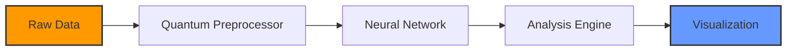

# 🚀 Project Nebula

[](https://opensource.org/licenses/MIT)
[](https://github.com/yourusername/project-nebula/stargazers)
[](https://github.com/yourusername)

<div align="center">
  
</div>

## 🌌 Overview

Project Nebula is a cutting-edge platform that harnesses the power of quantum algorithms and machine learning to analyze astronomical data at unprecedented speeds. Our mission is to democratize space exploration through accessible technology.

<details>
<summary>✨ Click to see our tech stack</summary>
<br>

| Frontend | Backend | ML/AI | DevOps |
|----------|---------|-------|--------|
| React | Node.js | TensorFlow | Docker |
| TypeScript | GraphQL | PyTorch | Kubernetes |
| Tailwind CSS | MongoDB | CUDA | GitHub Actions |
| Three.js | Redis | JAX | Terraform |

</details>

## 🔥 Features

- **Real-time Data Processing**: Analyze terabytes of cosmic data in milliseconds
- **3D Visualization**: Immersive exploration of celestial bodies
- **API Integration**: Connect with major space agency databases
- **Distributed Computing**: Leverage the power of our global compute network

## 📊 Performance



## 🚀 Quick Start

```bash
# Clone the repository
git clone https://github.com/yourusername/project-nebula.git

# Navigate to the project
cd project-nebula

# Install dependencies
npm install

# Configure your environment
cp .env.example .env

# Launch the application
npm run nebula:launch
```

## 🧪 Interactive Demo

<div align="center">
  <a href="https://yourusername.github.io/project-nebula-demo">
    
    <p>Click to launch interactive demo</p>
  </a>
</div>

## 📈 Project Roadmap

- [x] Core engine development
- [x] Beta testing phase
- [ ] Public API release
- [ ] Mobile application
- [ ] Quantum computing integration

## 🤝 Contributing

We welcome contributions from the community! Before submitting a PR, please check out our [contributing guidelines](CONTRIBUTING.md).

<details>
<summary>View contribution workflow</summary>

```
1. Fork the repository
2. Create your feature branch: `git checkout -b feature/amazing-feature`
3. Commit your changes: `git commit -m 'Add some amazing feature'`
4. Push to the branch: `git push origin feature/amazing-feature`
5. Open a Pull Request
```

</details>

## 💬 Community

[](https://discord.gg/yourserver)
[](https://twitter.com/projectnebula)

## 📜 License

This project is licensed under the MIT License - see the [LICENSE](LICENSE) file for details.

---

<div align="center">
  
  <p>If you find this project useful, consider <a href="https://github.com/sponsors/yourusername">sponsoring</a> its development!</p>
  
  
</div>
